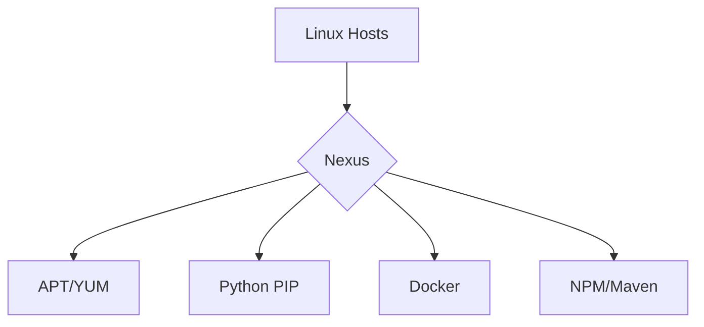

```markdown
# Nexus на Linux: Полное руководство для DevOps инженеров 🐧🔧

![Nexus + Linux]
*Оптимальная связка для управления артефактами в Linux-среде*

## Оглавление 📚
1. [Установка и настройка](#-установка-и-настройка)
2. [Интеграция с Linux-экосистемой](#-интеграция-с-linux-экосистемой)
3. [Автоматизация через Bash](#-автоматизация-через-bash)
4. [Мониторинг и диагностика](#-мониторинг-и-диагностика)
5. [Типичные проблемы и решения](#-типичные-проблемы-и-решения)
6. [Производительность и тюнинг](#-производительность-и-тюнинг)
7. [Полезные ресурсы](#-полезные-ресурсы)

---

## 🛠 Установка и настройка

### Требования к системе
- **ОС**: Ubuntu 20.04+/CentOS 7+
- **Железо**: 4+ ядра CPU, 8+ GB RAM, SSD 100+ GB
- **Сеть**: Статический IP, открытые порты 8081/8443

### 3 способа установки
```bash
# Способ 1: Нативный (systemd)
wget https://download.sonatype.com/nexus/3/latest-unix.tar.gz
tar -xvf latest-unix.tar.gz -C /opt
useradd -M -s /bin/false nexus
chown -R nexus:nexus /opt/nexus*
systemctl enable nexus.service

# Способ 2: Docker
docker run -d --name nexus -p 8081:8081 -v nexus-data:/nexus-data sonatype/nexus3

# Способ 3: Kubernetes Helm
helm repo add sonatype https://sonatype.github.io/helm3-charts/
helm install nexus sonatype/nexus-repository-manager
```

### Базовые настройки безопасности
```bash
# SELinux/AppArmor
semanage port -a -t http_port_t -p tcp 8081
setsebool -P httpd_can_network_connect 1

# Firewall
ufw allow 8081/tcp
ufw allow 8443/tcp

# Оптимизация ядра
echo "nexus - nofile 65536" >> /etc/security/limits.conf
sysctl -w vm.max_map_count=262144
```

---

## 🖇 Интеграция с Linux-экосистемой

### Управление пакетами


### Примеры конфигураций
**APT-репозиторий**:
```bash
# /etc/apt/sources.list.d/nexus.list
deb [trusted=yes] http://nexus:8081/repository/debian-main/ /
```

**Docker Registry**:
```bash
# /etc/docker/daemon.json
{
  "insecure-registries": ["nexus:8083"]
}
```

**Python PIP**:
```bash
# ~/.pip/pip.conf
[global]
index-url = http://nexus:8081/repository/pypi-group/simple
trusted-host = nexus
```

---

## 📜 Автоматизация через Bash

### Скрипт резервного копирования
```bash
#!/bin/bash
BACKUP_DIR="/backups/nexus"
TIMESTAMP=$(date +"%Y%m%d_%H%M%S")

tar -czf $BACKUP_DIR/nexus-$TIMESTAMP.tar.gz \
  --exclude=tmp \
  --exclude=cache \
  /nexus-data

find $BACKUP_DIR -type f -mtime +30 -delete
```

### Автоматическая очистка
```bash
# Удаление старых SNAPSHOT
nexus-cli cleanup -r maven-snapshots -k "last_downloaded < 30d-ago"

# Очистка Docker образов
nexus-cli docker delete -n my-registry -days 60
```

---

## 📊 Мониторинг и диагностика

### Ключевые метрики
```bash
# Дисковое пространство
df -h /nexus-data | awk '{print "Nexus Disk Usage: " $5}'

# Потребление памяти
ps -o %mem,pid,user,comm -C java | grep nexus

# Логи доступа
tail -f /opt/nexus/data/log/nexus.log | grep "GET /repository"
```

### Настройка Prometheus
```yaml
# prometheus.yml
scrape_configs:
  - job_name: 'nexus'
    metrics_path: '/service/metrics/prometheus'
    static_configs:
      - targets: ['nexus:8081']
```

---

## 🔧 Типичные проблемы и решения

### Проблема: "Недостаточно места на диске"
```bash
# Анализ хранилища
ncdu /nexus-data/storage

# Экстренная очистка
nexus-cli cleanup -r all -days 7 -force
```

### Проблема: "Ошибки аутентификации"
```bash
# Сброс пароля администратора
docker exec -it nexus cat /nexus-data/admin.password

# Проверка прав доступа
ls -lZ /nexus-data
```

---

## 🚀 Производительность и тюнинг

### Оптимизация JVM
```properties
# bin/nexus.vmoptions
-Xms4g
-Xmx4g
-XX:+UseStringDeduplication
-XX:+UseG1GC
-XX:MaxGCPauseMillis=200
```

### Конфигурация Nginx
```nginx
server {
    listen 443 ssl;
    server_name nexus.example.com;

    ssl_certificate /etc/ssl/nexus.crt;
    ssl_certificate_key /etc/ssl/nexus.key;

    location / {
        proxy_pass http://localhost:8081;
        proxy_set_header Host $host;
        proxy_set_header X-Real-IP $remote_addr;
        proxy_connect_timeout 300;
        proxy_send_timeout 300;
        proxy_read_timeout 300;
    }
}
```

---

## 📚 Полезные ресурсы

### Официальная документация
- [Nexus Repository Manager Docs](https://help.sonatype.com)
- [Docker образ Nexus](https://hub.docker.com/r/sonatype/nexus3)

### Сообщества
- [Stack Overflow: nexus](https://stackoverflow.com/questions/tagged/nexus)
- [Reddit: /r/devops](https://reddit.com/r/devops)

### Книги
- "Nexus Cookbook" by O'Reilly
- "DevOps with Nexus" by Packt Publishing

---


*💡 Совет: Регулярно проверяйте обновления через `yum update`/`apt upgrade`*
```
