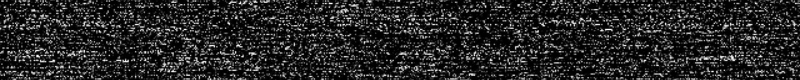

## Борьба с вирусом

*Комната наполнена низким гудящим звуком. Металлические пятна на коже Луми пульсируют в такт мерцанию монитора. Его голос теперь наполовину механический, наполовину живой:*

— Этот вирус ужасен! Он создал армию мёртвых процессов. Это процессы, которые уже завершили работу, но остались в системе как «призраки»... Они висят в памяти, пожирают ресурсы... Не отвечают на команды... Обычные сигналы на них не действуют. Это буквально зомби!
Они защищают ядро вируса.
Но есть слабость. Не используй SIGKILL! Это только усилит мутацию.
Уничтожай зомби правильно, через родительские процессы.
И не оставь сирот — иначе они станут новыми зомби...

*Тело Луми внезапно сковывает судорога. Металлическая паутина расползается по его груди*

— Торопись... Вирус почти захватил контроль...

### Ваша задача:

Запущенный на машине демон `zombie_general` создает иерархию процессов, включая:
- Зомби (незавершенные потомки);
- Сирот (усыпленные процессы, которые станут зомби при убийстве родителя);
- Ловушки (сохраним интригу).

Необходимо:
1. Проанализировать ситуацию:
	- Найти процесс демона `zombie_general`;
	- Построить дерево процессов и выявить всех потомков;
	- Найти всех зомби.
2. Уничтожить всех зомби.
3. Завершить демона и его потомков **без SIGKILL** (использование SIGKILL запрещено и приведет к провалу проверки).
4. Не оставить сирот.

### Итог выполнения задания

Обратите внимание на то, что будет проверяться автоматически:

1. Отсутствие зомби-процессов.
2. Убийство демона и потомков.
3. Использование SIGKILL для выполнения задания.