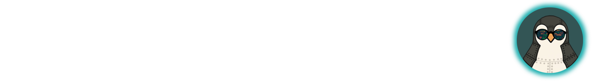

## Логи жизни

*Комната освещена ровным, спокойным светом монитора. 
Металлические пластины на теле Луми больше не пульсируют тревожным синим, 
а мерцают ровным, уверенным светом. Он сидит прямо, его движения хоть и всё ещё отдают механической точностью, 
но в них появилась привычная пингвинья плавность. Он внимательно изучает отчет report.md*

— Пока я был... не в себе, вирус действовал нагло и методично. 
Я уже вижу аномалии. Взгляни-ка: сервис cyberwatch.service, мой сторож, каждую ночь в 23:59 
таинственным образом перезагружается, и в этот же момент фиксируется всплеск трафика. 
Это не случайность. Это лазейка для вируса.
Нам нужно провести расследование. 

*Луми с лёгкой улыбкой смотрит на экран.*

— Раньше я просто чинил системы. Теперь, после того, как сам стал мишенью, я понимаю: настоящий администрирование — это не только лечение, но и патрулирование, расследование и создание системы правосудия. Давай же настроим её вместе. Чтобы в следующий раз мы были на шаг впереди.

### Ваша задача:

1. Найдите все перезапуски `cyberwatch.service` за последние 3 дня и сохраните их в файл `/var/log/cyberwatch_incidents.log`.
2. Настройте ротацию логов:
	- Настроить `logrotate` для `/var/log/cyberwatch_incidents.log`;
	- Условия: ротация раз в день, хранить максимум 7 ротаций, сжатие `gzip`.
3. Настройте `rsyslog`. Убедитесь, что логи `/var/log/cyberwatch_incidents.log` дублируются на удалённый сервер по адресу `10.0.0.2`, порт 514 UDP.
4. Перезапустите необходимые сервисы и убедитесь, что всё работает.

### Итог выполнения задания

Обратите внимание на то, что будет проверяться автоматически:

1. Наличие файла-журнала логов.
2. Содержимое этого файла.
3. Конфигурация logrotate.
4. Наличие сжатых логов.
5. Настройка rsyslog.
